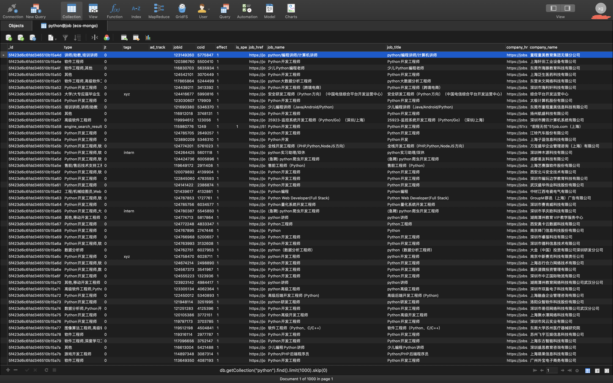
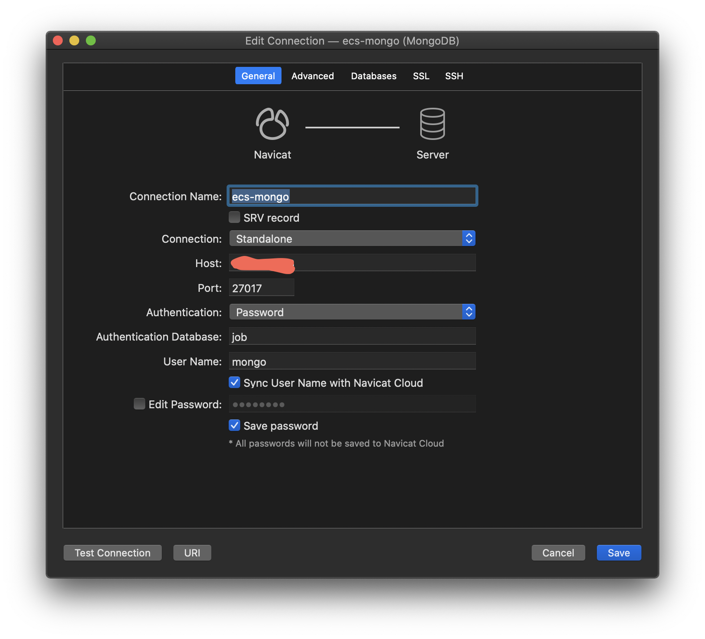

# crawl_job


<!-- TABLE OF CONTENTS -->
## Table of Contents

* [About the Project](#about-the-project)
  * [Architecture](#architecture)
  * [Files Structure](#files-structure)
* [Getting Started](#getting-started)
  * [Prerequisites](#prerequisites)
  * [Installation](#installation)
* [Usage](#usage)
  * [Crawl Data](#crawl-data)
  * [Connect DB](#connect-db)
* [To-Do](#To-Do)
* [License](#license)

<!-- ABOUT THE PROJECT -->
## About the Project
Crawl the whole country jobs and its detail information from a employment-oriented website according a keyword.

Project Characteristic:

- Docker-based Deployment
- MongoDB Database
- NLP-supported information extracting

Data Samples:
<p align="center">
    

### Architecture
* Ubuntu 20.04 : Operating System
* Python 3.6+ : Language
* Requests : third-party library to request data
* BeautifuleSoup : third-party library to parse data
* lxml : third-party library to parse data
* pymongo : MongoDB api third-party library
* [pyhanlp](https://github.com/hankcs/pyhanlp): third-party library to extract data
* [gne](https://github.com/kingname/GeneralNewsExtractor) : third-party library to extract data

### Files Structure
```
.
├── Dockerfile
├── LICENSE
├── README.md
├── data-samples.png
├── docker-compose.yml
├── init-mongo.js
├── module
│   ├── mongodb_api.py
│   ├── parse_data.py
│   └── request_data.py
├── requirements.txt
├── sources.list
└── spider.py

1 directory, 12 files
-------------------------------------------------------------------------------
Language                     files          blank        comment           code
-------------------------------------------------------------------------------
Python                           4             50             32            326
YAML                             1              2              3             21
Dockerfile                       1              4              9             20
JavaScript                       1              0              0             12
Markdown                         1              0              0              2
-------------------------------------------------------------------------------
SUM:                             8             56             44            381
-------------------------------------------------------------------------------
```

<!-- GETTING STARTED -->
## Getting Started

### Prerequisites
- 64bit Linux like Ubuntu, CentOS etc.
- [Docker](https://docs.docker.com/engine/install/ubuntu/)
- [docker-compose](https://docs.docker.com/compose/install/)

### Installation

1. ssh to remote server if local pass this step
```sh
>>> ssh xx@xx.xx.xx.xx
```
2. Clone the repo
```sh
>>> git clone https://github.com/MacwinWin/crawl_job.git
```
3. up services
```sh
>>> docker-compose up -d
```
4. checkout
```sh
>>> docker ps
CONTAINER ID        IMAGE                      COMMAND                  CREATED             STATUS              PORTS                      NAMES
7c80b736c628        mongo:latest               "docker-entrypoint.s…"   6 hours ago         Up 6 hours          0.0.0.0:27017->27017/tcp   crawl_job_db
3cb18d6cc7df        crawl_job                  "/bin/bash"              6 hours ago         Up 6 hours                                     crawl_job_spider
```

<!-- USAGE EXAMPLES -->
## Usage
### Crawl Data
```sh
# enter the container
>>> docker exec -it crawl_job_spider /bin/bash
# run spider.py
>>> nohup python3 -u spider.py -kw python > log.log 2>&1 &
# the first time run spider.py may take some time to download files for pyhanlp
```

### Connect DB

- Default port is 27017
- Default root user of MongoDB is 'root', password also is 'root'
- Default database is 'job', user is 'mongo', password also is 'mongo'
- Default collection is the keyword

<p align="center">
    

## To-Do
- Data Clean
- Data visualization using plotly

<!-- LICENSE -->
## License

Distributed under the MIT License. See `LICENSE` for more information.